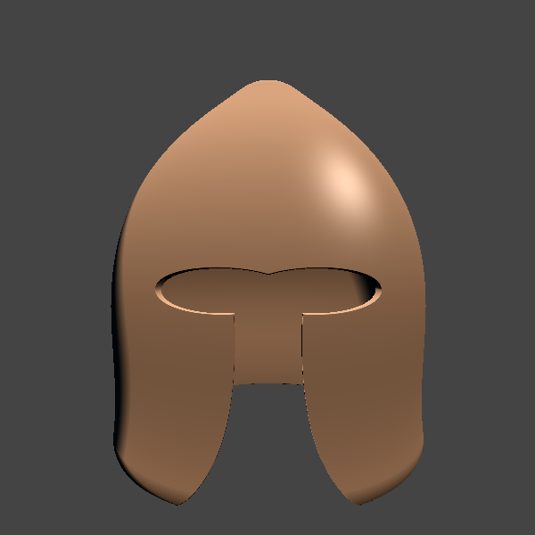

ForgedThoughts is a modeling and rendering programming language utilizing SDFs and is in early development.

For documentation and examples see the [Website](https://forgedthoughts.com).



# Created with

```rust
camera.origin.z = 0.75;

settings.width = 600;
settings.height = 600;

settings.background = F3("444");
settings.antialias = 5;
//settings.opacity = 0.0;

let phong = Phong();
phong.specular = F3(0.5, 0.5, 0.5);
settings.renderer = phong;

let light = PointLight();
light.position = F3(3.0, 3.0, 5.0);
light.intensity = 1.5;

// Main shape

let sphere = Sphere(0.24);
let cone = Cone(0.3, 0.25, 0.0);

let helmet = smin(sphere, cone, 0.5);
helmet.material.rgb = F3("9F6F4A");

// Make it hollow

let cut_out = helmet.copy();
cut_out.position.y -= 0.04;
cut_out.scale = 0.98;

helmet -= cut_out;

// Eye holes

let eyes = Ellipsoid();
eyes.size = F3(0.10, 0.03, 0.1);
eyes.position.x = 0.07;
eyes.position.y -= 0.03;
eyes.position.z = 0.3;
eyes.mirror.x = true;
helmet -= eyes;

// Nose and mouth

let cut = Box(F3(0.07, 0.2, 0.1));
cut.position.y -= 0.25;
cut.position.z = 0.2;

let modifier = RayModifier("x", "*", "sin", "y");
modifier.frequency = 10.0;
modifier.amplitude = 0.7;
modifier.addend = 1.0;
cut.modifier = modifier;

helmet -= cut;

// Stripe

let stripe = Box(F3(0.011, 0.17, 0.2));
stripe.position.y = 0.16;
stripe.position.z = 0.2;
helmet += Groove(stripe, 0.01, 0.02);

```
